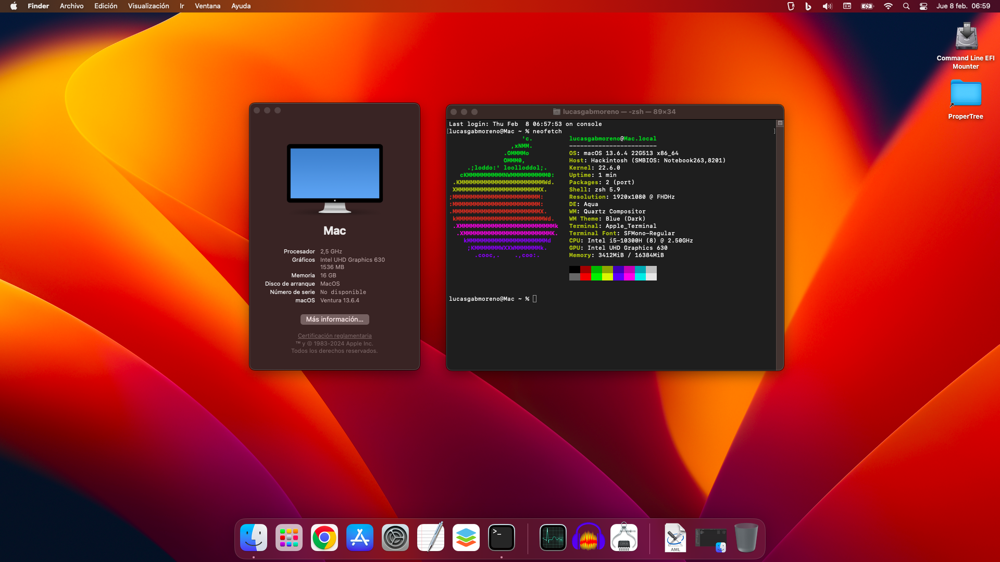
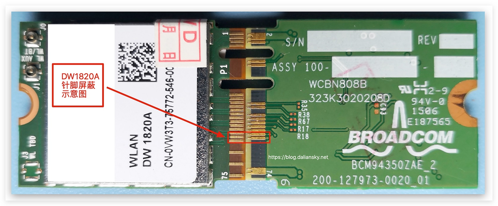

# ASUS TUF F15 FX506LHB HN324W - Hackintosh


  
### Working
- iGPU Intel Core i5-10300H Comet Lake
- Wifi & BT Broadcom BCM94350ZAE / DW 1820A
- Audio ALC256 (alcid 17, 21 and 33 works, 56 and 88 works but low sound at mic)
- LAN Realtek RTL8168
- Trackpad & Keyboard
- Brightness (keepsyms=1 debug=0x100 -wegnoegpu)

### Not Working
- dGPU NVIDIA GTX 1650 Turing: [Not supported](https://dortania.github.io/GPU-Buyers-Guide/modern-gpus/nvidia-gpu.html#native-nvidia-gpus)
- Wifi & BT Realtek Mediatek MT7921: [Replaced](https://dortania.github.io/Wireless-Buyers-Guide/unsupported.html#supported-chipsets)
- Jack microphone

---

## BIOS
1. Into the BIOS (turn on the computer and press F2) change settings to:
   
| Var   | Status |
|:---|:---|
| Secure Boot | Disabled|
| Fast Boot | Disabled |

---

## Solutions

### Wifi not working
#### Temporary fix:
1. Press power button for 30 seconds
2. Reboot
3. If keyboard isn't working, reboot again
#### Permanent fix:
1. Open notebook and unmount wifi card
2. Use electrical insulate tape and cover these 3 pins at front and 2 pins back:<br><br>
<br>
Source image: [Daliansky](https://blog.daliansky.net/DW1820A_BCM94350ZAE-driver-inserts-the-correct-posture.html)
3. This will cause not to get sleep your wifi card. It is not 100% permanent. If you experience a Wi-Fi drop, use the temporary method again by pressing power button for 30 seconds.

### 5Ghz wifi signal not detected
1. Get into your rooter (192.168.0.1)
2. If your 5Ghz wifi signal channel is 36, change it to 40.

### Sleep/Wake
1. Open terminal and disabel Sleep/Wake:
```
sudo pmset autopoweroff 0
sudo pmset powernap 0
sudo pmset standby 0
sudo pmset proximitywake 0
sudo pmset tcpkeepalive 0
```
2. Go to system preferences and disable sleep/awake

### iCloud Ban/iMessages Ban or WiFi/Ethernet
If you need to fix iCloud Ban/iMessages Ban or WiFi/Ethernet Issues
```
sudo rm /Library/Preferences/SystemConfiguration/NetworkInterfaces.plist
sudo rm /Library/Preferences/SystemConfiguration/preferences.plist
```

